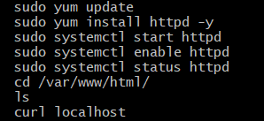

# Deploying a Web Application on AWS EC2 with Apache (Amazon Linux)

This project demonstrates how to launch and host a basic web application on an AWS EC2 instance using the Apache Web Server and **Amazon Linux**.

## Steps Followed 🚀

1. **Launch EC2 Instance (Amazon Linux)**  
   - Deployed an Amazon EC2 instance with **Amazon Linux 2** in the Virginia (us-east-1) region.
   - Selected an appropriate security group.

2. **Connect to EC2 Instance**  
   - Accessed the instance using SSH and a `.pem` private key.

3. **Install and Configure Apache**  
   - Installed Apache (`httpd`) using `yum` (Amazon Linux default package manager).
   - Started and enabled the Apache service.
   - Verified service status to ensure the web server was active.

4. **Deploy Web Application Files**  
   - Transferred local web application files to the `/var/www/html/` directory.

5. **Configure Security Groups**  
   - Updated inbound rules to allow HTTP (port 80)  traffic from all IP addresses.

6. **Access Application**  
   - Retrieved the EC2 instance's public IP.
   - Loaded the web application in a browser using the IP address.

## Skills Practiced 🔥

- AWS EC2 provisioning  
- Apache setup on **Amazon Linux**  
- Secure remote access using SSH  
- Cloud networking and security group rules  
- Static web hosting on the cloud  

---
## 📷 Screenshots
- Terminal Commands

- Apache Running

- Web App Live

---

## 📚 Technologies Used

- AWS EC2
- Amazon Linux 2
- Apache Web Server (httpd)
- SSH

